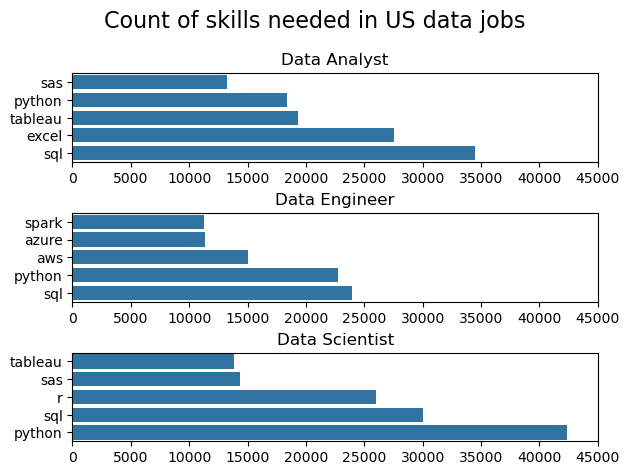
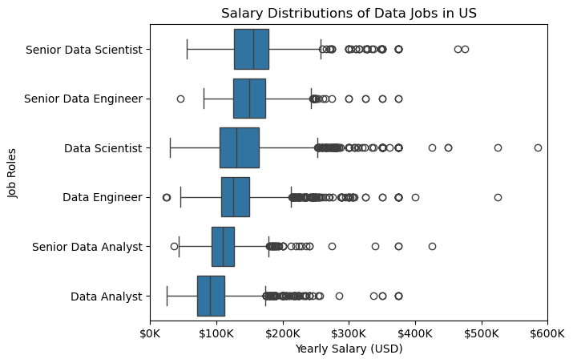
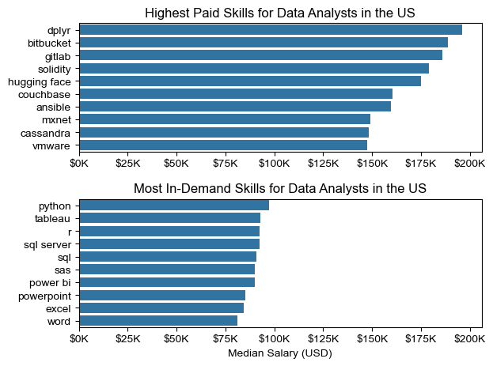
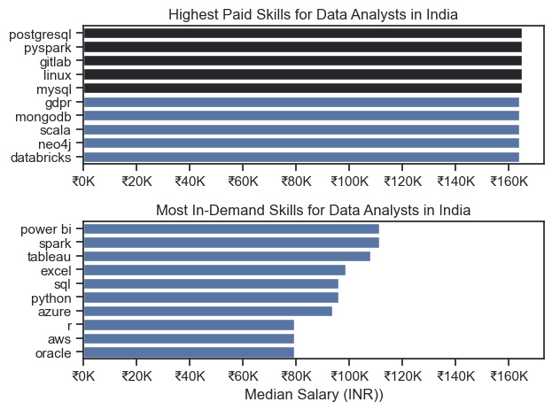
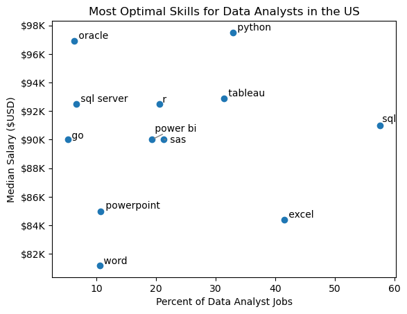
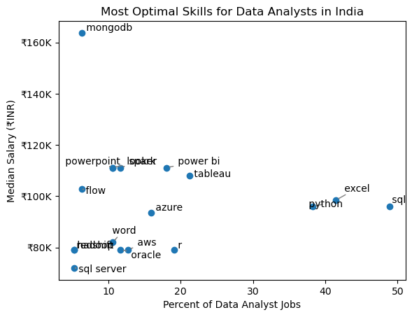

# Overview

Welcome to my analysis of the data job market, focusing on data analyst roles. It delves into the top-paying and in-demand skills to help find optimal job opportunities for data analysts.

The data sourced from (lukebarousse/data_jobs) hugging face dataset which provides detailed information on job titles, salaries, locations, and essential skills. Through a series of Python scripts, I explore key questions such as the most demanded skills, salary trends, and the intersection of demand and salary in data analytics.

# The Questions

Below are the questions I want to answer in my project:

1. What are the skills most in demand for the top 3 most popular data roles?
2. How are in-demand skills trending for Data Analysts?
3. How well do jobs and skills pay for Data Analysts?
4. What are the optimal skills for data analysts to learn? (High Demand AND High Paying) 

# Tools I Used

For my deep dive into the data analyst job market, I harnessed the power of several key tools:

- **Python:** The backbone of my analysis, allowing me to analyze the data and find critical insights.
I also used the following Python libraries:
    - **Pandas Library:** This was used to analyze the data. 
    - **Matplotlib Library:** I visualized the data.
    - **Seaborn Library:** Helped me create more advanced visuals. 
- **Visual Studio Code:** My go-to for executing my Python scripts.
- **GitHub:** Essential for sharing my Python code and analysis.

# Data Preparation and Cleanup

This section outlines the steps taken to prepare the data for analysis, ensuring accuracy and usability.

## Import & Clean Up Data

I start by importing necessary libraries and loading the dataset, followed by initial data cleaning tasks to ensure data quality.

```python
# Importing Libraries
import ast
import pandas as pd
import seaborn as sns
from datasets import load_dataset
import matplotlib.pyplot as plt  

# Loading Data
dataset = load_dataset('lukebarousse/data_jobs')
df = dataset['train'].to_pandas()

# Data Cleanup
df['job_posted_date'] = pd.to_datetime(df['job_posted_date'])
df['job_skills'] = df['job_skills'].apply(lambda x: ast.literal_eval(x) if pd.notna(x) else x)
```

## Filter US and India Jobs

To focus my analysis on the U.S. and the Indian job market, I apply filters to the dataset, narrowing down to roles based in the United States and India

```python
df_US = df[df['job_country'] == 'United States']

```
&

```python
df_US = df[df['job_country'] == 'India']

```

# The Analysis

Each file for this project aimed at investigating specific aspects of the data job market. Here’s how I approached each question:

## 1. What are the most demanded skills for the top 3 most popular data roles?

To find the most demanded skills for the top 3 most popular data roles. I filtered out those positions by which ones were the most popular, and got the top 5 skills for these top 3 roles. This query highlights the most popular job titles and their top skills, showing which skills I should pay attention to depending on the role I'm targeting for both US and India

View my file with detailed steps here: [2-Skill_Demand](2-Skill_Demand.ipynb).

### Visualize Data

```python
fig, ax = plt.subplots(len(job_titles), 1)

for i, job_title in enumerate(job_titles):
    df_plot = df_skills_count[df_skills_count['job_title_short']==job_title].head(5)[::-1]
    sns.barplot(data=df_plot, x='skill_count', y='job_skills', ax=ax[i])
    ax[i].set_title(job_title)
    ax[i].set_ylabel('')
    ax[i].set_xlabel('')
    ax[i].set_xlim(0, 45000)

fig.suptitle('Count of skills needed in US Job postings', fontsize=16)
fig.tight_layout(h_pad=0.5)
plt.show()
```

&

```python
fig, ax = plt.subplots(len(job_titles_Ind), 1)

for i, job_title_Ind in enumerate(job_titles_Ind):
    df_plot = df_skills_Ind_count[df_skills_Ind_count['job_title_short']==job_title_Ind].head(5)[::-1]
    sns.barplot(data=df_plot, x='skill_count', y='job_skills', ax=ax[i])
    ax[i].set_title(job_title_Ind)
    ax[i].set_ylabel('')
    ax[i].set_xlabel('')
    ax[i].set_xlim(0, 14000)

fig.suptitle('Count of skills needed in Indian data jobs', fontsize=16)
fig.tight_layout(h_pad=0.6)
plt.show()
```

## Results

### US



*Bar graph showing the top 5 skills required for each of the top 3 data roles in U.S.*

### Insights:

- **Data Analyst**:
  - SQL and Excel dominate.
  - Python, Tableau, and SAS also widely needed.

- **Data Engineer**:
  - SQL and Python top the list.
  - AWS, Azure, and Spark are secondary but essential.

- **Data Scientist**:
  - Python is key, followed by SQL and R.
  - SAS and Tableau less in demand.


### India


*Bar graph showing the top 5 skills required for each of the top 3 data roles in India.*

### Insights:

- **Data Analyst**:
  - Top skills: SQL, Python, Excel.
  - Power BI and Tableau less demanded but relevant.

- **Data Engineer**:
  - Most required: SQL, Python.
  - Also important: Spark, AWS, Azure.

- **Data Scientist**:
  - Python leads, followed by SQL and R.
  - AWS and Tableau play smaller roles.

### Summary

- **SQL & Python**: Core across all roles and regions.
- **Excel**: Critical for Analysts, especially in the US.
- **Cloud (AWS, Azure)** & **Big Data (Spark)**: Key for Engineers.
- **R & SAS**: Important for Scientists, more so in the US.


## 2. How are in-demand skills trending for Data Analysts?

To find how skills are trending in 2023 for Data Analysts, I filtered data analyst positions and grouped the skills by the month of the job postings. This got me the top 5 skills of data analysts by month, showing how popular skills were throughout 2023 for both US and India.

View my file with detailed steps here: [3-Skills_Trend](3-Skills_Trend.ipynb).

### Visualize Data

```python

from matplotlib.ticker import PercentFormatter

df_plot = df_DA_US_percent.iloc[:, :5]
sns.lineplot(data=df_plot, dashes=False)
sns.despine()

plt.title('Trending Top Skills for Data Analysts in US')
plt.ylabel('Likelihood in Job Posting')
plt.xlabel('2023')
plt.legend().remove()
plt.gca().yaxis.set_major_formatter(PercentFormatter(decimals=0))

for i in range(5):
    plt.text(11.2, df_plot.iloc[-1, i], df_plot.columns[i], color='black')

plt.show()

```
&

```python

from matplotlib.ticker import PercentFormatter

df_plot = df_DA_Ind_percent.iloc[:, :5]
sns.lineplot(data=df_plot, dashes=False)
sns.despine() 

plt.title('Trending Top Skills for Data Analysts in India')
plt.ylabel('Likelihood in Job Posting')
plt.xlabel('2023')
plt.legend().remove()
plt.gca().yaxis.set_major_formatter(PercentFormatter(decimals=0))

for i in range(5):
    plt.text(11.2, df_plot.iloc[-1, i], df_plot.columns[i], color='black')

plt.show()

```

## Results

### US

  
*Bar graph visualizing the trending top skills for data analysts in the US in 2023.*

### Insights:

- **SQL**: Top skill; slight decline from Jan (~63%) to Dec (~55%).
- **Excel**: Steady early on, peaks in Aug (~46%), rebounds in Dec.
- **Python**: Gradual decline (~35% → ~30%), still key.
- **Tableau**: Stable, hovers around 28–33%.
- **Power BI**: Lowest demand; slight year-end rise (~22%).

### India

  
*Bar graph visualizing the trending top skills for data analysts in India in 2023.*

### Insights:

- **SQL**: Most in-demand skill all year; peaks in May (~68%).
- **Python**: Steady demand (~40–44%).
- **Excel**: Sharp spike in May (~58%), then stabilizes.
- **Tableau**: Fluctuates but stays around 30–40%.
- **Power BI**: Least in demand, but rises toward year-end (~35%).

### Summary

- **SQL** leads in both countries.
- **Excel** stronger in the US; surging in India mid-year.
- **Python/Tableau** remain essential, stable.
- **Power BI** shows growth, especially in India.

## 3. How well do jobs and skills pay for Data Analysts?

To identify the highest-paying roles and skills, I used jobs in the United States and in India looked at their median salary. But first I looked at the salary distributions of common data jobs like Data Scientist, Data Engineer, and Data Analyst, to get an idea of which jobs are paid the most in US.

View my file with detailed steps here: [4-Salary_Analysis](4-Salary_Analysis.ipynb).

#### Visualize Data 

```python
sns.boxplot(data= df_US_top6, x='salary_year_avg', y='job_title_short', order=job_order)
plt.title('Salary Distributions of Data Jobs in US')
plt.xlabel('Yearly Salary (USD)')
plt.ylabel('Job Roles')
plt.xlim(0, 600000) 
ticks_x = plt.FuncFormatter(lambda y, pos: f'${int(y/1000)}K')
plt.gca().xaxis.set_major_formatter(ticks_x)
plt.show()
```

## Results

  
*Box plot visualizing the salary distributions for the top 6 data job titles in US.*

## Insights

- **Highest Median Salaries**:
  - Senior Data Scientist and Senior Data Engineer roles lead in pay.
  - Both show median salaries around or above $150K.

- **Entry to Mid-Level Roles**:
  - Data Analyst and Senior Data Analyst have the lowest medians (~$85K–$115K).
  - Data Scientist and Data Engineer sit in the mid-tier (~$120K–$140K).

- **Salary Spread**:
  - All roles show wide salary ranges, with some offers exceeding $400K.
  - More outliers appear at senior levels, indicating high variance and potential bonuses/stocks.

### Highest Paid & Most Demanded Skills for Data Analysts in both US and India

Next, I narrowed my analysis and focused only on data analyst roles. I looked at the highest-paid skills and the most in-demand skills. I used two bar charts to showcase these.

#### Visualize Data

```python
fig, ax = plt.subplots(2, 1)  

# Top 10 Highest Paid Skills for Data Analysts
sns.barplot(data=df_DA_top_pay, x='median', y=df_DA_top_pay.index, ax=ax[0])

 
ax[0].set_title('Highest Paid Skills for Data Analysts in the US')
ax[0].set_ylabel('')
ax[0].set_xlabel('')
ax[0].xaxis.set_major_formatter(plt.FuncFormatter(lambda x, _: f'${int(x/1000)}K'))

# Top 10 Most In-Demand Skills for Data Analysts')
sns.barplot(data=df_DA_skills, x='median', y=df_DA_skills.index, ax=ax[1])

ax[1].set_title('Most In-Demand Skills for Data Analysts in the US')
ax[1].set_ylabel('')
ax[1].set_xlabel('Median Salary (USD)')
ax[1].set_xlim(ax[0].get_xlim())
ax[1].xaxis.set_major_formatter(plt.FuncFormatter(lambda x, _: f'${int(x/1000)}K'))

sns.set_theme(style='ticks')
plt.tight_layout()
plt.show()
```

&

```python
fig, ax = plt.subplots(2, 1)  

# Top 10 Highest Paid Skills for Data Analysts
sns.barplot(data=df_DA_top_pay_Ind, x='median', y=df_DA_top_pay_Ind.index, ax=ax[0],  palette='dark:b_r', hue='median')
ax[0].legend().remove()
ax[0].set_title('Highest Paid Skills for Data Analysts in India')
ax[0].set_ylabel('')
ax[0].set_xlabel('')
ax[0].xaxis.set_major_formatter(plt.FuncFormatter(lambda x, _: f'₹{int(x/1000)}K'))

# Top 10 Most In-Demand Skills for Data Analysts')
sns.barplot(data=df_DA_skills_Ind, x='median', y=df_DA_skills_Ind.index, ax=ax[1])
ax[1].set_title('Most In-Demand Skills for Data Analysts in India')
ax[1].set_ylabel('')
ax[1].set_xlabel('Median Salary (INR))')
ax[1].set_xlim(ax[0].get_xlim())
ax[1].xaxis.set_major_formatter(plt.FuncFormatter(lambda x, _: f'₹{int(x/1000)}K'))

plt.tight_layout()
plt.show()
```
## Results

### US

Here's the breakdown of the highest-paid & most in-demand skills for data analysts in US:

*Two separate bar graphs visualizing the highest paid skills and most in-demand skills for data analysts in US.*

#### Insights:

- **Highest Paying Skills**:
  - Top pay: dplyr, Bitbucket, GitLab, Solidity, Hugging Face.
  - AI/DevOps tools (Ansible, MXNet, Couchbase) show high compensation.

- **Most In-Demand Skills**:
  - Python, Tableau, R, and SQL Server top the list.
  - Excel, Power BI, and even tools like PowerPoint remain key.
  - Word and SAS indicate ongoing legacy tool usage.

### India

Here's the breakdown of the highest-paid & most in-demand skills for data analysts in India:

*Two separate bar graphs visualizing the highest paid skills and most in-demand skills for data analysts in India.*

#### Insights:

- **Highest Paying Skills**:
  - Top pay: PostgreSQL, PySpark, GitLab, Linux.
  - Emerging high-value tech: Databricks, Scala, MongoDB.

- **Most In-Demand Skills**:
  - Power BI, Spark, Tableau, and Excel lead.
  - SQL and Python still widely required.
  - Cloud & DB tools (Azure, AWS, Oracle) growing in relevance.

## Summary

- **High Salary ≠ High Demand**: Tools like GitLab and PySpark offer high pay but aren’t the most in-demand.
- **India**: Strong mix of database, BI, and cloud tools in demand.
- **US**: Open-source and enterprise tools dominate both pay and demand.

## 4. What are the most optimal skills to learn for Data Analysts?

To identify the most optimal skills to learn (the ones that are the highest paid and highest in demand) I calculated the percent of skill demand and the median salary of these skills. To easily identify which are the most optimal skills to learn. 

View my file with detailed steps here: [5-Optimal_Skills](5-Optimal_Skills.ipynb).

#### Visualize Data

```python
plt.scatter(df_DA_skills_high_demand['skill_percent'], df_DA_skills_high_demand['median_salary'])
plt.xlabel('Percent of Data Analyst Jobs')
plt.ylabel('Median Salary ($USD)')  
plt.title('Most Optimal Skills for Data Analysts in the US')
ax = plt.gca()
ax.yaxis.set_major_formatter(plt.FuncFormatter(lambda y, pos: f'${int(y/1000)}K')) 

texts = []
for i, txt in enumerate(df_DA_skills_high_demand.index):
    texts.append(plt.text(df_DA_skills_high_demand['skill_percent'].iloc[i], df_DA_skills_high_demand['median_salary'].iloc[i], " " + txt))

adjust_text(texts, arrowprops=dict(arrowstyle='->', color='gray'))
plt.show()
```
## Results

### US

    
*A scatter plot visualizing the most optimal skills (high paying & high demand) for data analysts in US.*
#### Insights:

- **Top Salary & Demand Combo**: Python, Tableau, SQL.
- **High Salary, Low Demand**: Oracle, SQL Server, Go – niche but lucrative.
- **High Demand, Lower Pay**: Excel, PowerPoint – essential but lower reward.

### India

    
*A scatter plot visualizing the most optimal skills (high paying & high demand) for data analysts in India.*

#### Insights:

- **Top Salary & Demand Combo**: SQL, Excel, Tableau, Power BI.
- **High Salary, Low Demand**: MongoDB, Spark, PowerPoint – fewer jobs, high ROI.
- **High Demand, Lower Pay**: Python, AWS, Word – widespread but less premium.

## Summary

- **Strategic Upskilling**: Niche technologies (e.g., MongoDB in India, Oracle in US) offer higher salaries.
- **Balance is Key**: Skills like Python, SQL, and Tableau strike a solid balance between job availability and compensation.


# Challenges I Faced

While working through this project, I encountered several challenges that helped me grow both technically and analytically:

- **Data Quality Issues**  
  Some records had missing or malformed data (e.g., empty skill lists, inconsistent salary values). Cleaning this required careful filtering and transformation, especially for nested or stringified list fields like `job_skills`.

- **Skill Parsing**  
  Since skills were stored as stringified Python lists, I had to convert them using `ast.literal_eval()` and ensure they were properly flattened and standardized before analysis.

- **Dealing with Salary Outliers**  
  Some job postings had salaries that were either unrealistically low or extremely high (>$500K), which skewed average metrics. I handled this by using median salaries and setting sensible axis limits in plots.

- **Visualization Clarity**  
  Initially, some of the charts were cluttered due to too many categories or poorly scaled axes. I improved readability by limiting categories (e.g., top 10 only), sorting bars, and labeling axes clearly.


# Final Insights

- **Python and SQL are King**  
  These two skills appeared most frequently across job postings, making them foundational for data-related roles.

- **Location Still Matters**  
  Despite remote trends, certain locations (like San Francisco, New York) still dominate high-salary offerings.

- **Niche Skills Pay Off**  
  Roles demanding specialized tools (e.g., Snowflake, Kafka, Airflow) often offered above-average salaries, reflecting demand for deep technical expertise.

- **Data Roles are Diverse**  
  There's a wide spread of roles from Data Analysts to Machine Learning Engineers. Each demands slightly different skillsets and offers varying compensation.

- **Visualization Makes a Difference**  
  Communicating insights clearly through visual storytelling was just as important as the data processing itself.

# Conclusion

This project provided valuable hands-on experience in handling real-world data, from cleaning and transforming raw datasets to uncovering meaningful insights through visualization. It reinforced the importance of data storytelling and the role of thoughtful analysis in career and business decision-making. Most importantly, it deepened my understanding of the current data job market and the evolving landscape of in-demand skills.

Whether you're a job seeker, a hiring manager, or a data enthusiast, I hope this project offers a helpful glimpse into the world of data roles today.


